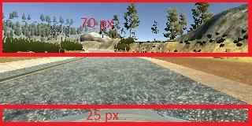
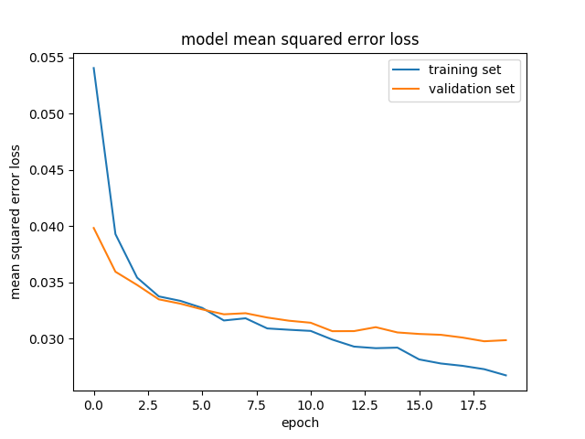

## Writeup
# Behavioral Cloning Project
The goal of this project is to create a CNN based DL model trained on simulated training data to autonomously drive the car using the same simulator. Simulator link below:
https://github.com/udacity/self-driving-car-sim.

## Training Data Collection Strategy
Training data was collected as 3 batches:
1. Regular driving ([link](https://drive.google.com/file/d/1L1DW-o2uAp8EBQCpzfPK52W1B-Q0SCJF/view?usp=sharing))
    - 2 laps of regular driving around the track staying in the center of the lane.
2. Reverse driving ([link](https://drive.google.com/file/d/1-EO57dtrpJJuKNgONutkLBtuXiMVkGVI/view?usp=sharing))
    - 1 lap of reverse driving to ensure the data has variability in surrounding scenery.
3. Recovery driving ([link](https://drive.google.com/file/d/1vXZqxQbEatiThfn0p_LRKkWe7kOW38_4/view?usp=sharing))
    - Recovery driving from edge of the lane to back to the center of the road. This data was recoded intermittantly only around the curves on the lap. Amount of data collected is comparable to 1 lap of regular driving.

## Data Augmentation
- Flipped images
    - Added vertically flipped image for every image in training data. This ensures the data generalizes to both left and right turns.
- Left, right camera images
    - Include left, right camera images. Use steer angle + 0.2, -0.2 for left, right images respectively.

## Model Architecture
- The model architecture is based on LeNet:
    - Input: (160, 320, 3)
    - Normalize pixels to [-0.5, 0.5] using kera Lambda.
    - Crop image to remove top 70px, bottom 25px to retain only relevant information. 
    - Conv2D layer 1
        - 24 convolutions, 5x5 kernel, valid padding
        - Activation: 'relu'
        - MaxPooling2D with pool_size (2, 2)
        - Dropout: 0.3
    - Conv2D layer 2
        - 36 convolutions, 5x5 kernel, valid padding
        - Activation: 'relu'
        - MaxPooling2D with pool_size (2, 2)
        - Dropout: 0.3
    - Conv2D layer 3
        - 48 convolutions, 3x3 kernel, valid padding
        - Activation: 'relu'
        - MaxPooling2D with pool_size (2, 2)
        - Dropout: 0.3
    - Flatten
    - Fully connected layer 1
        - Dense: 256 neurons
        - Activation: 'relu'
        - Dropout: 0.3
    - Fully connected layer 2
        - Dense: 64 neurons
        - Activation: 'relu'
        - Dropout: 0.3
    - Output later: Dense with 1 neuron (steering angle)

Notes: 2, 3, 4 layers of Conv2D layers were tried out along with additional layers fully connected layers. The training and validation losses were faily similar with the above combination returning the best performance with a relatively small model. 

## Hyperparameters
- learn_rate = '0.001'
- batch_size = 128
- n_epochs = 20

Notes: Above combination resulted in the lowest training and validation loss. Learning rates 0.0005, 0.0002 also returned good results but the training took longer to converge. The loss plot across epochs below show that validation loss starts to converge around 18 epochs while the training loss keeps dropping. Increasing epochs beyond 20 resulted in an overfit model (training loss significantly lower than validation loss).

## Tetsing the model and capturing video
To test the model and capture images, run command below
>`python drive.py model_LR_LeNetCnn3Dense3_Drp0.3_LR0.001_rnd1234.h5 auto_capture`

To convert images to video, run:
>`python video.py auto_capture\ --fps 48`

## Links to training code, model and test video below:
- Training code: [model.py](model.py)
- Model H5: [model_LR_LeNetCnn3Dense3_Drp0.3_LR0.001_rnd1234.h5](model_LR_LeNetCnn3Dense3_Drp0.3_LR0.001_rnd1234.h5)
- Output video: [model_LR_LeNetCnn3Dense3_Drp0.3_LR0.001_rnd1234.mp4](model_LR_LeNetCnn3Dense3_Drp0.3_LR0.001_rnd1234.mp4)

# Discussion
The car tends to swevre around a little bit when the road curvature is relatively small. This is due to over steering and correction. This can be partially attributed to augmented data from left, right camera images and also to intermittant steering commands used in data collection. Using keyboard to steer makes it hard to obtain smooth and continuous steering values. On the otherhand, aumented data from left/right cameras results in a smoother steering.

Ensuring consistency between data sets or using a more complex architecture with more data could result in a better driving experience. Augmented data from left/right cameras was cruicial to keep the car on the track and could not be dropped.

# Dependencies
Download env from: https://github.com/udacity/CarND-Term1-Starter-Kit/blob/master/environment.yml
